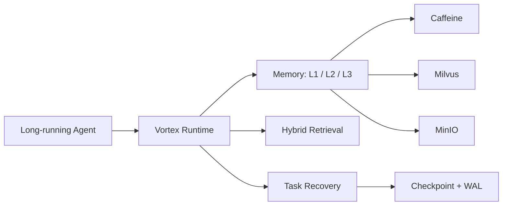
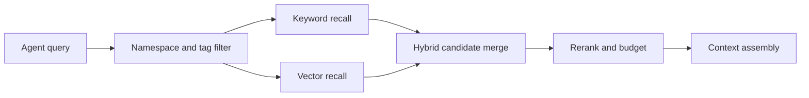
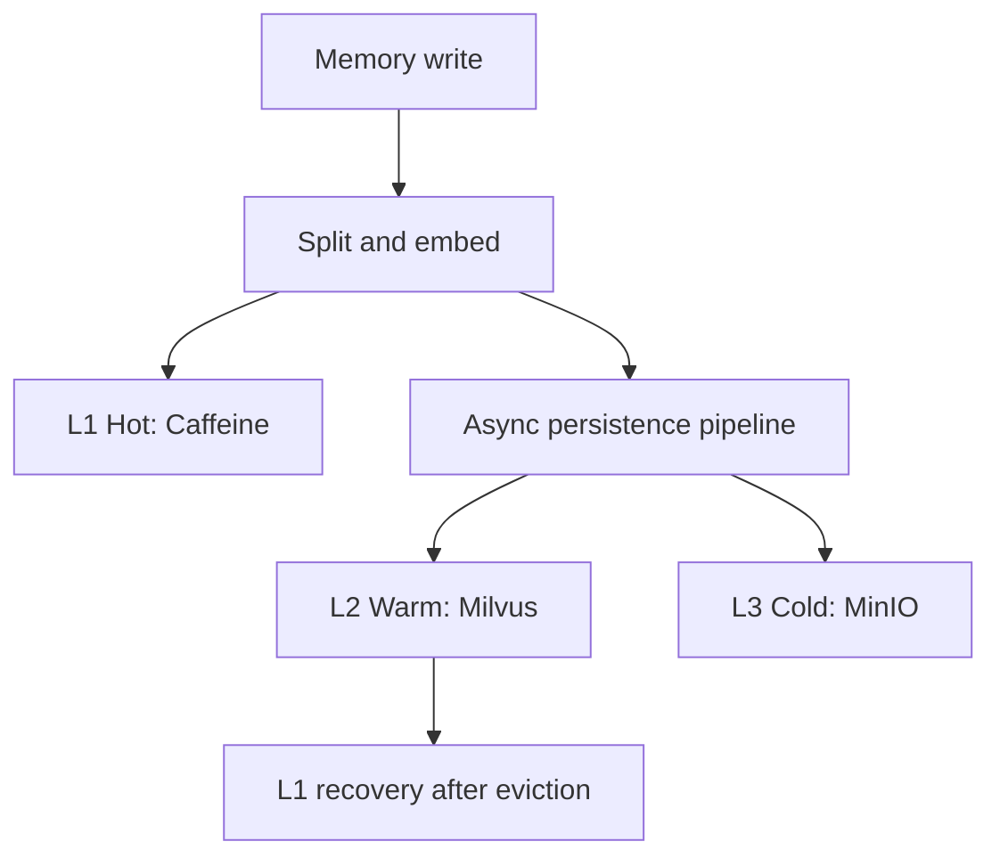
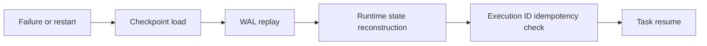

# Vortex

<p align="center">
  English | <a href="README_zh.md">简体中文</a>
</p>

[](https://github.com/HaibaraAi2517/Vortex/actions/workflows/ci.yml)
[](LICENSE)
[](pom.xml)
[](vortex-app/pom.xml)
[](docker-compose.yml)

**Memory and RAG runtime for long-running AI agents: remember across sessions,
retrieve the right context, and resume after crashes. Built with Java 21,
Spring Boot, Milvus, MinIO, Redis, and Caffeine.**

Long-running agents fail in predictable ways. Vortex turns those failure modes
into backend runtime primitives:

| Agent pain | Vortex runtime primitive |
| --- | --- |
| Context disappears across sessions and token pressure. | Tiered long-term memory with L1 Caffeine, L2 Milvus, and L3 MinIO. |
| Retrieval quality degrades when vector search misses exact operational facts. | Hybrid recall: keyword + vector candidates, rerank, namespaces, tags, and token budgets. |
| Multi-step work dies on restart or tool/LLM failures. | Task DAG checkpoints, WAL replay, runtime snapshots, and Execution ID idempotency. |

<p align="center">
  <a href="#quick-start"><b>Quick Start</b></a> ·
  <a href="examples/quickstart-agent"><b>Agent Demo</b></a> ·
  <a href="docs/architecture.md"><b>Architecture</b></a> ·
  <a href="docs/benchmark.md"><b>Benchmarks</b></a> ·
  <a href="docs/comparison.md"><b>Comparison</b></a>
</p>



Vortex is a benchmarked infrastructure kernel, not a hosted SaaS. The repository
keeps runnable code, deterministic eval harnesses, evidence reports, runbooks,
and CI governance checks together.

## Benchmark Evidence

The headline numbers below are deterministic benchmark results with linked
evidence and reproduction commands. See [docs/benchmark.md](docs/benchmark.md)
for scope, boundaries, and reproduction notes. They are not production
guarantees.

| Area | Result | Evidence |
| --- | --- | --- |
| Hybrid recall | `Hybrid+Rerank` improved Recall@5 from `0.7917` to `0.9500` versus `Vector+Rerank`, a `+20.00%` relative lift, with `0/100` run errors across five retrieval modes. | [Recall ablation evidence](ops/runbooks/vortex-recall-ablation-benchmark-evidence-20260630.md) |
| Main-path latency | Moving memory extraction, summary, embedding, L1 admission, L2 indexing, and L3 archive off the measured request path reduced P99 from `1172.50 ms` to `220.34 ms`; average latency fell from `829.40 ms` to `186.64 ms`. | [Main-path latency evidence](ops/runbooks/vortex-main-path-latency-benchmark-evidence-20260629.md) |
| Runtime recovery | The deterministic fault-injection matrix passed `32/32` covered cases across service restart, tool failure, LLM exception, state integrity, and concurrency categories. | [Runtime recovery evidence](ops/runbooks/vortex-runtime-recovery-benchmark-evidence-20260627.md) |

These results should not be restated as full production recovery coverage,
end-to-end LLM quality improvement, online recall improvement, or full Agent
latency reduction. The linked evidence files define the exact scope.

## Architecture

Detailed architecture notes live in [docs/architecture.md](docs/architecture.md).

Hybrid retrieval:



Three-tier memory:



Runtime recovery:



```text
vortex-app      REST API, Actuator, OpenAPI, eval CLI, benchmark runners
vortex-kernel   memory orchestration, recall, eviction, async pipeline, recovery
vortex-storage  L1 Caffeine, L2 Milvus, L3 MinIO
vortex-common   shared models, DTOs, serialization, exceptions, contracts
```

## Quick Start

The container-first path is documented in [docs/quickstart.md](docs/quickstart.md). It starts Vortex with Milvus, MinIO, Redis, and etcd, and does not require any external LLM API key.

For local development, use the host Maven path:

Prerequisites:

- JDK 21
- Maven 3.9+
- Docker Desktop / Docker Compose

The default local BGE model files are tracked under `models/bge-small-zh/`.

```powershell
docker compose up -d --wait
mvn -pl vortex-app -am -DskipTests package
java -jar .\vortex-app\target\vortex-app-0.1.0-SNAPSHOT-exec.jar
```

Open:

- Swagger UI: `http://localhost:8080/swagger-ui.html`
- Health: `http://localhost:8080/actuator/health`
- Prometheus: `http://localhost:8080/actuator/prometheus`
- MinIO console: `http://localhost:9001` with `minioadmin` / `minioadmin`

Stop dependencies:

```powershell
docker compose down
```

## Zero-Key Agent Demo

With the quickstart stack running, try the focused demo in [examples/quickstart-agent](examples/quickstart-agent):


Transcript from the recorded local run: [docs/assets/quickstart-agent-demo.txt](docs/assets/quickstart-agent-demo.txt).

```powershell
.\examples\quickstart-agent\run.ps1
```

It shows memory off/on behavior and kills a worker process before recovering the task from a Vortex checkpoint. No external LLM API key is required.

Java/Spring users can also try the [Spring AI ChatClient advisor example](examples/spring-ai-integration), which injects Vortex recall into a Spring AI system prompt without requiring an external LLM key.

## Try The Memory API

Store memory:

```bash
curl -X POST http://localhost:8080/api/v1/memory/store \
  -H "Content-Type: application/json" \
  -d '{
    "content": "Java synchronized provides mutual exclusion and visibility guarantees.",
    "namespace": "session-1",
    "tags": ["java", "concurrency"],
    "reasoningChainId": "chain-1"
  }'
```

Recall memory:

```bash
curl -X POST http://localhost:8080/api/v1/memory/recall \
  -H "Content-Type: application/json" \
  -d '{
    "query": "Java concurrency lock visibility",
    "namespace": "session-1",
    "topK": 5,
    "tokenBudget": 2048,
    "tags": ["java"],
    "scenario": "coding"
  }'
```

Async ingest is available through `POST /api/v1/memory/store/async`, with
pipeline status at `GET /api/v1/memory/pipeline/{pipelineId}`.

## Task State And Recovery API

Vortex also exposes a task-state kernel for long-running agent workflows:

| Capability | API |
| --- | --- |
| Create/list/fetch/complete/fail/delete tasks | `/api/v1/tasks` |
| Mutate task DAG nodes and edges | `/api/v1/tasks/{taskId}/nodes` |
| Update task context | `/api/v1/tasks/{taskId}/context` |
| Create/list/recover checkpoints | `/api/v1/tasks/{taskId}/checkpoint`, `/recover` |
| Branch, switch, and merge task state | `/branch`, `/branch/switch`, `/merge` |
| Export Graphviz DOT | `/api/v1/tasks/{taskId}/dag` |

Mutating task APIs accept the optional `X-Execution-Id` header for idempotent
replay protection.

## Build And Test

CI runs unit tests, app integration verification, baseline governance, and
learning governance:

```powershell
mvn -B test -pl vortex-common,vortex-kernel,vortex-storage -am
mvn -B verify -pl vortex-app -am
./ops/run-baseline-governance-check.ps1 -SkipMavenTest -SkipPackage
./ops/run-learning-governance-check.ps1 -SkipMavenTest -SkipPackage -SkipLearningRun
```

`vortex-app` integration verification starts Docker Compose during
`pre-integration-test` and stops it during `post-integration-test`.

## Eval CLI

Package the eval CLI:

```powershell
mvn -pl vortex-app -am -DskipTests package
```

Available benchmark commands:

```text
recall-benchmark
runtime-recovery-benchmark
async-pipeline-latency-benchmark
```

Use the evidence runbooks for isolated Milvus collections, MinIO prefixes, WAL
directories, and exact environment variables:

- [Recall ablation](ops/runbooks/vortex-recall-ablation-benchmark-evidence-20260630.md)
- [Main-path latency](ops/runbooks/vortex-main-path-latency-benchmark-evidence-20260629.md)
- [Runtime recovery](ops/runbooks/vortex-runtime-recovery-benchmark-evidence-20260627.md)
- [Async pipeline latency](ops/runbooks/vortex-async-pipeline-latency-benchmark-evidence-20260628.md)

## Configuration

Default configuration lives in
[`vortex-app/src/main/resources/application.yml`](vortex-app/src/main/resources/application.yml).

Common environment variables:

| Variable | Default | Purpose |
| --- | --- | --- |
| `VORTEX_STORAGE_L1_MAX_TOKENS` | `8192` | L1 token capacity |
| `MILVUS_HOST` / `MILVUS_PORT` | `localhost` / `19530` | Milvus connection |
| `VORTEX_STORAGE_L2_MILVUS_COLLECTION` | `vortex_memory` | Milvus collection |
| `VORTEX_L2_EMBEDDING_DIM` | `512` | L2 vector dimension |
| `MINIO_ENDPOINT` / `MINIO_BUCKET` | `http://localhost:9000` / `vortex` | L3 object storage |
| `MINIO_KEY_PREFIX` | empty | Object key prefix for isolation |
| `VORTEX_EXECUTION_ID_BACKEND` | `MEMORY` | Idempotency backend; Redis is optional |
| `BGE_MODEL_PATH` | `models/bge-small-zh` | Local BGE model directory |
| `VORTEX_GENERATION_ENABLED` | `false` | Enable external LLM generation integration |
| `VORTEX_PAGING_ENABLED` | `true` | Enable semantic paging |

Changing the Milvus vector dimension is destructive and must be explicit:

```powershell
$env:MILVUS_DROP_COLLECTION = "true"
$env:MILVUS_DROP_CONFIRM_TOKEN = "I-KNOW-WHAT-I-AM-DOING"
```

Reset those values after the one-time migration.

## Project Status

For positioning against plain vector RAG and hand-rolled memory layers, see
[docs/comparison.md](docs/comparison.md). The first alpha release draft lives in
[docs/releases/v0.1.0-alpha.md](docs/releases/v0.1.0-alpha.md).

Implemented and covered by code/tests/runbooks:

- Hierarchical memory store, recall, feedback, pin/unpin, and eviction.
- Vector, keyword, hybrid, and rerank retrieval paths.
- Async memory ingest pipeline with persistence status tracking.
- Task DAG, checkpoint, WAL replay, branch/switch/merge, and recovery.
- Health catalog, SLO snapshots, Prometheus metrics, and monitoring assets.
- Deterministic benchmark and governance harnesses.

Not claimed yet:

- Production-grade auth, RBAC, tenant isolation, rate limits, or audit logs.
- Long-duration high-concurrency production capacity results.
- Distributed consensus, multi-node scheduling, or cross-region replication.
- Full external process-manager crash-loop orchestration.
- Full Agent runtime integration with real LLM generation inside the latency benchmark.

## Repository Map

```text
.
|-- vortex-common/        shared contracts, DTOs, serialization, exceptions
|-- vortex-storage/       L1/L2/L3 storage APIs and implementations
|-- vortex-kernel/        memory, retrieval, recovery, snapshot, paging, learning
|-- vortex-app/           Spring Boot API, eval CLI, benchmark runners, tests
|-- ops/                  runbooks, evidence reports, CI/governance scripts
|-- docs/                 architecture and benchmark summaries
|-- demo/                 demo scripts
|-- examples/             focused runnable examples
|-- models/bge-small-zh/  default local BGE-Small model files
|-- docker-compose.yml    etcd, Milvus, MinIO, Redis
`-- pom.xml               Maven multi-module parent
```

## Tech Stack

- Java 21 with preview enabled
- Spring Boot 3.3.4
- Maven multi-module build
- Caffeine 3.1.8
- Milvus SDK 2.4.4
- MinIO 8.5.11
- Redis 7.2 optional Execution ID backend
- Kryo 5.6.0
- DJL 0.28.0 and ONNX Runtime 1.18.0 for local BGE embeddings
- Testcontainers 2.0.2

## Community

- Contribution guide: [CONTRIBUTING.md](CONTRIBUTING.md)
- Roadmap: [ROADMAP.md](ROADMAP.md)
- Code of conduct: [CODE_OF_CONDUCT.md](CODE_OF_CONDUCT.md)
- Suggested GitHub description/topics: [docs/repo-settings.md](docs/repo-settings.md)

## License

Vortex code and documentation are licensed under the [Apache License 2.0](LICENSE).

Third-party model files, datasets, and external service names remain subject to
their upstream licenses and terms.
