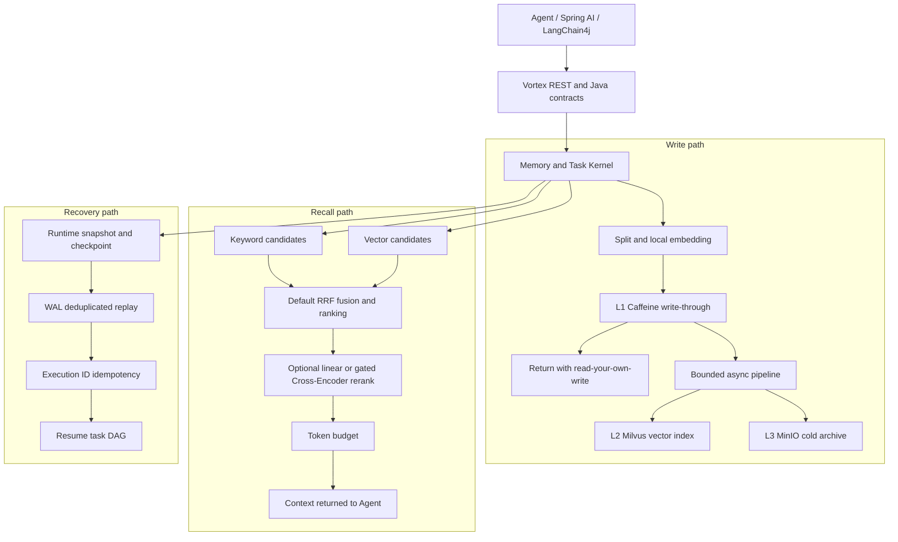

# Vortex

<p align="center">
  English | <a href="README.md">简体中文</a>
</p>

[](https://github.com/HaibaraAi2517/Vortex/actions/workflows/ci.yml)
[](docs/releases/v0.2.0.md)
[](LICENSE)
[](pom.xml)
[](vortex-app/pom.xml)
[](docker-compose.yml)

**Memory and RAG runtime for long-running AI agents: remember across sessions,
retrieve the right context, and resume after crashes. Built with Java 21,
Spring Boot, Milvus, MinIO, Redis, and Caffeine.**

`v0.2.0` is the latest tagged release with a complete evidence package. Vortex
is an infrastructure kernel rather than a hosted SaaS: the repository keeps
code, deterministic benchmarks, failure-injection evidence, and reproduction
paths together. Current branches or local worktrees may contain behavior changes
after that tag and do not automatically inherit its test, coverage, or benchmark
claims.

The `v0.2.0` release gates cover a clean Maven verify, `13/13` Docker
integration cases, Windows, Linux, and macOS Quickstart, a pulled signed
candidate image, and backup/restore plus upgrade/rollback drills. See the
[v0.2.0 release notes](docs/releases/v0.2.0.md). Older benchmark numbers remain
scoped to their corresponding tags.

<p align="center">
  <a href="#demo"><b>Demo</b></a> ·
  <a href="#quick-start"><b>Quick Start</b></a> ·
  <a href="#three-core-engineering-decisions"><b>Engineering Decisions</b></a> ·
  <a href="docs/benchmark.md"><b>Benchmarks</b></a> ·
  <a href="docs/architecture.md"><b>Detailed Architecture</b></a>
</p>

## Before You Use Vortex

- Vortex currently targets source review, local demos, and integration trials
  on trusted isolated networks. It is not a production service that should be
  exposed directly to the public Internet.
- A direct host-run application listens on `127.0.0.1` and keeps security
  disabled by default for local development compatibility. Quickstart requires
  a 32-character-or-longer Bearer token, a namespace allowlist, API rate limits,
  and audit events. This is a trusted-environment trial boundary, not production
  OIDC, RBAC, or multi-tenant authentication.
- The REST service is published as the immutable OCI image
  `ghcr.io/haibaraai2517/vortex:0.2.0`. Java Maven artifacts are not published;
  embedded use still requires a source build.
- Quickstart publishes only the Vortex API at
  `127.0.0.1:${VORTEX_HTTP_PORT:-8080}`. Redis, Milvus, MinIO, and management
  ports remain on the Compose network. The start scripts generate random MinIO,
  Redis, and Bearer credentials for the process.

## Demo

<p align="center">
  
</p>

The no-key demo stores and recalls durable memory, checkpoints a task, stops its
worker, and then resumes the task from the recovered runtime state. No external
LLM API key is required.

## System Architecture



The synchronous boundary ends at L1 visibility. Durable indexing and archival
run behind a bounded pipeline; recall and recovery remain separate kernel paths.
This boundary is the central latency, consistency, and failure-recovery decision
in the project.

The current public recall contract defaults to `HYBRID + RRF`, with the
additional reranker disabled. `VECTOR_ONLY`, `KEYWORD_ONLY`, MMR, linear score
fusion, and the gated Cross-Encoder remain explicit request options. The frozen
`HYBRID_RRF` candidate passed the read-only DEV and sealed validation gates and
was promoted; `VectorOnly` remains the rollback and historical comparison path.
See the [Recall Ranking v2 evaluation](ops/runbooks/vortex-recall-ranking-v2-evaluation-20260802.md).

## Quick Start

Prerequisites:

- Docker Desktop or Docker Engine with Compose v2
- At least 6 GB available memory
- Windows command: Windows PowerShell 5.1 or later
- Linux/macOS command: `bash`, `curl`, `python3`, `openssl`, and standard `seq`
- Run Quickstart only on a trusted local machine; it uses loopback port `8080`
  by default

On Windows, check active listeners and excluded port ranges first:

```powershell
Get-NetTCPConnection -LocalPort 8080 -ErrorAction SilentlyContinue
netsh interface ipv4 show excludedportrange protocol=tcp
```

If `8080` conflicts, set `VORTEX_HTTP_PORT` to another available port. This
changes only the host mapping, not Vortex's internal `8080` port or any storage
service port. Quickstart still runs when host ports `6379`, `19530`, `9000`,
`9001`, or `9091` are occupied because those ports are not published.
Set a unique `COMPOSE_PROJECT_NAME` as well when running a second Quickstart.

One command builds the current checkout, waits for health, stores and recalls
memory, kills a worker after checkpointing, and resumes the task:

```powershell
powershell -NoProfile -ExecutionPolicy Bypass -File .\examples\quickstart-agent\run.ps1 -StartQuickstart
```

Linux/macOS:

```bash
START_QUICKSTART=true bash examples/quickstart-agent/run.sh
```

Those scripts generate random credentials that exist only in that process and
its Compose child process. For later curl calls, live demos, or Java integration
examples, create reusable credentials in `.env.local` and load them into the
host shell:

```powershell
Copy-Item .env.example .env.local
# Replace every placeholder in .env.local first.
Get-Content .env.local | ForEach-Object {
  if ($_ -match '^\s*([^#][^=]*)=(.*)$') {
    [Environment]::SetEnvironmentVariable($matches[1].Trim(), $matches[2], "Process")
  }
}
docker compose --env-file .env.local -f docker-compose.quickstart.yml pull
docker compose --env-file .env.local -f docker-compose.quickstart.yml up --no-build -d --wait
```

For direct release adoption, follow the [Quickstart guide](docs/quickstart.md)
and start the fixed `ghcr.io/haibaraai2517/vortex:0.2.0` image from
`.env.example` with `--no-build`. The demo commands above intentionally build
the current source checkout.

A successful run prints `WITH VORTEX: recalled durable memory`, then
`WITH VORTEX: recovered task ...`, and finishes with
`No external LLM API key was used.` Stop the stack with:

```bash
docker compose --env-file .env.local -f docker-compose.quickstart.yml down
```

The recorded output and expanded HTTP walkthrough live in
[examples/quickstart-agent](examples/quickstart-agent) and
[docs/quickstart.md](docs/quickstart.md).

Swagger UI and the OpenAPI document load anonymously. Enter the Bearer token in
`Authorize` before calling business APIs; Prometheus and detailed management
endpoints remain protected. The Spring AI and LangChain4j examples read
`VORTEX_SECURITY_BEARER_TOKEN` and use `quickstart-*` namespaces compatible with
the default Quickstart allowlist:

- [Spring AI ChatClient advisor example](examples/spring-ai-integration/README.md)
- [LangChain4j ChatRequest transformer example](examples/langchain4j-integration/README.md)

## Benchmark Evidence

The headline numbers below are deterministic benchmark results with linked
evidence and reproduction commands. See [docs/benchmark.md](docs/benchmark.md)
for scope, boundaries, and reproduction notes. They are not production
guarantees.

| Area | Result | Evidence |
| --- | --- | --- |
| LongMemEval recall | On the official LongMemEval oracle, a 120-case case-isolated evaluation completed five modes and `600` paired runs with `0` errors. `VectorOnly` reached fragment Recall@5 `0.8094` and exceeded `KeywordOnly` by `+0.1856`, paired 95% CI `[+0.1086, +0.2632]`. | [LongMemEval evaluation report](ops/runbooks/vortex-recall-longmemeval-evaluation-report-20260729.md) |
| Cross-Encoder gate | A pinned ONNX Cross-Encoder DEV candidate changed ordering in `120/120` cases but failed five frozen quality and latency rules. `VectorOnly` was the model-promotion baseline for that evidence version; validation and reserve were not run. | [Cross-Encoder DEV decision](ops/runbooks/vortex-cross-encoder-dev-decision-20260729.md) |
| Main-path latency | With synchronous pre-extraction chunking and local embedding for L1 write-through, then final processing in a bounded background pipeline, measured P99 fell from `818.82 ms` to `268.65 ms` (`-67.19%`) over 100 cases per mode. L1 visibility at return and eventual L2/L3 readiness were both `100%`. | [Write-through latency evidence](ops/runbooks/vortex-main-path-latency-write-through-evidence-20260728.md) |
| Runtime recovery | The deterministic fault-injection matrix passed `32/32` covered cases across service restart, tool failure, LLM exception, state integrity, and concurrency categories. | [Runtime recovery evidence](ops/runbooks/vortex-runtime-recovery-benchmark-evidence-20260627.md) |

Recall is oracle-fragment retrieval, not answer accuracy. Latency is from a
local deterministic benchmark with external LLM generation excluded, not
production P99 or full Agent latency. The linked evidence files define the
exact scope; the rejected Cross-Encoder result is not evidence of model gain.

## Three Core Engineering Decisions

### 1. Return after L1 write-through; persist final state asynchronously

**Problem.** Synchronously extracting, summarizing, indexing, and archiving every
memory made the request path pay for work that the caller did not need before
return.

**Decision.** Vortex synchronously splits the pre-extraction memory, creates its
local embedding, and admits the chunks to L1. Final extraction, L2 indexing, and
L3 archival move to a bounded pipeline with retry and backpressure. The caller
gets read-your-own-write semantics without waiting for all durable tiers.

**Trade-off.** The design accepts eventual L2/L3 readiness and must expose
pipeline status and failure handling. In return, deterministic 100-case runs
reduced main-path P99 from `818.82 ms` to `268.65 ms` while preserving `100%`
L1 visibility at return and eventual L2/L3 readiness. See the
[write-through latency evidence](ops/runbooks/vortex-main-path-latency-write-through-evidence-20260728.md).

**Implementation.** [AsyncMemoryPipeline](vortex-kernel/src/main/java/com/vortex/kernel/hmc/AsyncMemoryPipeline.java)
defines the bounded handoff; [HierarchicalMemoryController](vortex-kernel/src/main/java/com/vortex/kernel/hmc/HierarchicalMemoryController.java)
owns chunking, local embedding, and L1 admission.

### 2. Prefer an auditable retrieval baseline over an unproven reranker

**Problem.** A shared evaluation namespace caused cross-case leakage, and a
reranker can appear useful simply because it changes ordering.

**Decision.** For `v0.1.1`, the contaminated result was discarded, LongMemEval
was rerun with case isolation, and model promotion was placed behind five frozen
quality and latency gates. The pinned ONNX Cross-Encoder changed `120/120`
rankings but failed the gate, so it was not promoted as the default reranker.
Current code additionally introduces `HYBRID + RRF` as the default candidate
fusion path while keeping the extra reranker disabled. The frozen candidate
passed the read-only DEV and sealed validation gates and was promoted as the
guarded public default.

**Trade-off.** Vortex gives up speculative Cross-Encoder gain and retains
`VectorOnly` as a rollback and comparison baseline. The current Hybrid/RRF
default broadens keyword and vector candidate coverage, but also adds ranking
complexity and a new validation obligation. The `v0.1.1` isolated 120-case run
reached fragment
Recall@5 `0.8094`, `+0.1856` over `KeywordOnly`, with paired 95% CI
`[+0.1086, +0.2632]`. See the
[LongMemEval report](ops/runbooks/vortex-recall-longmemeval-evaluation-report-20260729.md),
[Cross-Encoder decision](ops/runbooks/vortex-cross-encoder-dev-decision-20260729.md),
and [Recall Ranking v2 promotion evidence](ops/runbooks/vortex-recall-ranking-v2-evaluation-20260802.md).

**Implementation.** [RecallQuery](vortex-common/src/main/java/com/vortex/common/dto/RecallQuery.java)
defines the evidence-backed defaults; [RecallOrchestrator](vortex-kernel/src/main/java/com/vortex/kernel/hmc/RecallOrchestrator.java)
implements the explicit retrieval and reranker branches.

### 3. Combine Snapshot, WAL, and Execution ID instead of claiming distributed exactly-once

**Problem.** A checkpoint alone cannot distinguish completed work from an
in-flight tool or LLM call after a restart, so replay can duplicate side
effects.

**Decision.** Runtime snapshots persist the task DAG, conversation, memory
references, and tool/LLM state. Recovery loads a checkpoint, deduplicates WAL
replay, reconstructs state, and uses Execution ID request hashes, atomic
reservation, and response replay for idempotency.

**Trade-off.** This adds serialization, WAL write amplification, and stricter
state-transition contracts. It provides deterministic single-runtime recovery,
not distributed consensus or cross-region exactly-once. The default Execution
ID backend is process memory; Quickstart explicitly switches it to Redis.
In-flight reservations do not expire on the business TTL; retention starts only
after `COMPLETED` or `UNKNOWN`, preventing side-effect replay when a long action
crosses its TTL. Abandoned `IN_PROGRESS` records require manual review.
Quickstart persists WAL, DLQ, processed keys, and application state under the
`/var/lib/vortex` volume. The fault-injection matrix passed `32/32` covered cases
across five failure categories. See the
[runtime recovery evidence](ops/runbooks/vortex-runtime-recovery-benchmark-evidence-20260627.md).

**Implementation.** [SnapshotService](vortex-kernel/src/main/java/com/vortex/kernel/snapshot/SnapshotService.java)
persists checkpoints, [RecoveryEngine](vortex-kernel/src/main/java/com/vortex/kernel/snapshot/RecoveryEngine.java)
replays runtime state, and [ExecutionIdService](vortex-app/src/main/java/com/vortex/app/runtime/ExecutionIdService.java)
guards externally visible execution.

## Implementation Surface

| Surface | What is implemented |
| --- | --- |
| Memory | Store, recall, feedback, pin/unpin, eviction, async ingest status, namespace/tag filtering, and token budgets |
| Retrieval | Keyword, vector, hybrid candidate merge, optional reranking gates, and context assembly |
| Runtime state | Task DAG mutation, checkpoint, WAL replay, branch/switch/merge, and Execution ID idempotency |
| Storage | L1 Caffeine, L2 Milvus, L3 MinIO, plus optional Redis-backed Execution ID state |
| Model integration | Vortex generation/embedding contracts, Spring AI example, and LangChain4j adapters |
| Operations | Health catalog, SLO snapshots, Prometheus metrics, deterministic benchmarks, and governance checks |

The public REST surface is documented by the anonymously accessible Swagger UI
at `http://localhost:8080/swagger-ui.html` after Quickstart; enter the configured
Bearer token through Swagger's `Authorize` dialog before calling business APIs.
Prometheus and detailed management endpoints remain authenticated. Detailed endpoints
and configuration remain in [docs/quickstart.md](docs/quickstart.md) and
[docs/architecture.md](docs/architecture.md). CI and benchmark reproduction
commands are linked from [docs/benchmark.md](docs/benchmark.md).

## Project Boundaries

For positioning against plain vector RAG and hand-rolled memory layers, see
[docs/comparison.md](docs/comparison.md). The stable portfolio release is
[`v0.2.0`](docs/releases/v0.2.0.md); earlier release notes remain archived.
The Chinese-language
[external adoption and release readiness manual](ops/runbooks/vortex-external-adoption-readiness-manual.md)
contains the remediation steps and release acceptance criteria.

Vortex does not claim:

- Production OIDC/mTLS, fine-grained RBAC, independent tenant identities, or
  distributed rate-limit and audit aggregation. Quickstart currently provides
  one shared Bearer token, a namespace allowlist, in-process rate limiting, and
  structured audit events.
- Long-duration high-concurrency production capacity results.
- Distributed consensus, multi-node scheduling, or cross-region replication.
- Full external process-manager crash-loop orchestration.
- Full Agent runtime integration with real LLM generation inside the latency benchmark.

The current usage boundary is:

| Scenario | Status |
| --- | --- |
| Source reading, portfolio review, and local demo | Supported |
| REST trials on a trusted isolated network | Conditionally supported with the immutable OCI image, Quickstart token, namespace, and loopback-port boundaries |
| Direct Maven/Gradle dependency | Artifacts are not published yet |
| Public, multi-tenant, or production deployment | Not supported |

## License

Vortex code and documentation are licensed under the [Apache License 2.0](LICENSE).
Model and dependency attribution is recorded in
[THIRD_PARTY_NOTICES.md](THIRD_PARTY_NOTICES.md). Deployment, backup/restore, and
migration procedures are in the
[deployment operations runbook](ops/runbooks/vortex-deployment-operations.md),
and candidate validation is in the
[release checklist](ops/runbooks/vortex-release-checklist.md).

Third-party model files, datasets, and external service names remain subject to
their upstream licenses and terms. The repository-level Apache-2.0 license does
not automatically cover those assets. Verify model and dataset provenance,
licenses, and attribution requirements before redistribution or commercial use.
