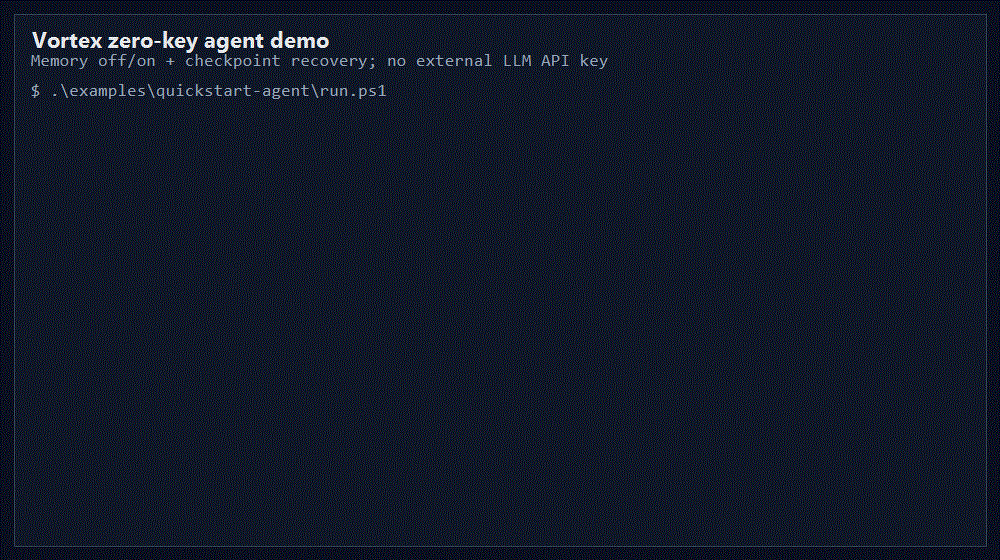
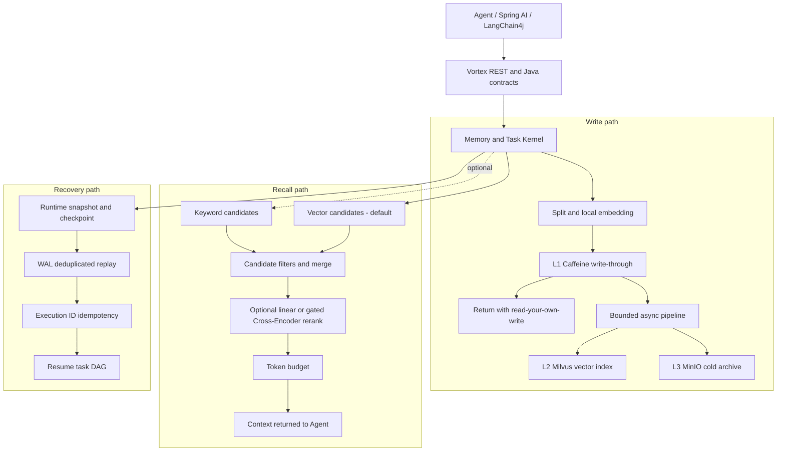

# Vortex

<p align="center">
  English | <a href="README.md">简体中文</a>
</p>

[](https://github.com/HaibaraAi2517/Vortex/actions/workflows/ci.yml)
[](docs/releases/v0.1.1.md)
[](LICENSE)
[](pom.xml)
[](vortex-app/pom.xml)
[](docker-compose.yml)

**Memory and RAG runtime for long-running AI agents: remember across sessions,
retrieve the right context, and resume after crashes. Built with Java 21,
Spring Boot, Milvus, MinIO, Redis, and Caffeine.**

`v0.1.1` is the stable, evidence-backed portfolio release. Vortex is an
infrastructure kernel rather than a hosted SaaS: the repository keeps code,
deterministic benchmarks, failure-injection evidence, and reproduction paths
together.

Release verification: `548` tests with zero failures, `13/13` Docker integration
cases, and `74.26%` aggregate line coverage. See the
[v0.1.1 release notes](docs/releases/v0.1.1.md).

<p align="center">
  <a href="#demo"><b>Demo</b></a> ·
  <a href="#quick-start"><b>Quick Start</b></a> ·
  <a href="#three-core-engineering-decisions"><b>Engineering Decisions</b></a> ·
  <a href="docs/benchmark.md"><b>Benchmarks</b></a> ·
  <a href="docs/architecture.md"><b>Detailed Architecture</b></a>
</p>

## Demo

<p align="center">
  
</p>

The no-key demo stores and recalls durable memory, checkpoints a task, stops its
worker, and then resumes the task from the recovered runtime state. No external
LLM API key is required.

## System Architecture



The synchronous boundary ends at L1 visibility. Durable indexing and archival
run behind a bounded pipeline; recall and recovery remain separate kernel paths.
This boundary is the central latency, consistency, and failure-recovery decision
in the project.

The public recall contract defaults to `VECTOR_ONLY` with reranking disabled.
`HYBRID`, linear score fusion, and the gated Cross-Encoder remain explicit
opt-in paths.

## Quick Start

Prerequisites:

- Docker Desktop or Docker Engine with Compose v2
- At least 6 GB available memory
- Windows command: Windows PowerShell 5.1 or later
- Linux/macOS command: `bash`, `curl`, and `python3`

One command builds the stack, waits for health, stores and recalls memory, kills
a worker after checkpointing, and resumes the task:

```powershell
powershell -NoProfile -ExecutionPolicy Bypass -File .\examples\quickstart-agent\run.ps1 -StartQuickstart
```

Linux/macOS:

```bash
START_QUICKSTART=true bash examples/quickstart-agent/run.sh
```

A successful run prints `WITH VORTEX: recalled durable memory`, then
`WITH VORTEX: recovered task ...`, and finishes with
`No external LLM API key was used.` Stop the stack with:

```bash
docker compose -f docker-compose.quickstart.yml down
```

The recorded output and expanded HTTP walkthrough live in
[examples/quickstart-agent](examples/quickstart-agent) and
[docs/quickstart.md](docs/quickstart.md).

## Benchmark Evidence

The headline numbers below are deterministic benchmark results with linked
evidence and reproduction commands. See [docs/benchmark.md](docs/benchmark.md)
for scope, boundaries, and reproduction notes. They are not production
guarantees.

| Area | Result | Evidence |
| --- | --- | --- |
| LongMemEval recall | On the official LongMemEval oracle, a 120-case case-isolated evaluation completed five modes and `600` paired runs with `0` errors. `VectorOnly` reached fragment Recall@5 `0.8094` and exceeded `KeywordOnly` by `+0.1856`, paired 95% CI `[+0.1086, +0.2632]`. | [LongMemEval evaluation report](ops/runbooks/vortex-recall-longmemeval-evaluation-report-20260729.md) |
| Cross-Encoder gate | A pinned ONNX Cross-Encoder DEV candidate changed ordering in `120/120` cases but failed five frozen quality and latency rules. `VectorOnly` remains the public request default and model-promotion baseline; validation and reserve were not run. | [Cross-Encoder DEV decision](ops/runbooks/vortex-cross-encoder-dev-decision-20260729.md) |
| Main-path latency | With synchronous pre-extraction chunking and local embedding for L1 write-through, then final processing in a bounded background pipeline, measured P99 fell from `818.82 ms` to `268.65 ms` (`-67.19%`) over 100 cases per mode. L1 visibility at return and eventual L2/L3 readiness were both `100%`. | [Write-through latency evidence](ops/runbooks/vortex-main-path-latency-write-through-evidence-20260728.md) |
| Runtime recovery | The deterministic fault-injection matrix passed `32/32` covered cases across service restart, tool failure, LLM exception, state integrity, and concurrency categories. | [Runtime recovery evidence](ops/runbooks/vortex-runtime-recovery-benchmark-evidence-20260627.md) |

Recall is oracle-fragment retrieval, not answer accuracy. Latency is from a
local deterministic benchmark with external LLM generation excluded, not
production P99 or full Agent latency. The linked evidence files define the
exact scope; the rejected Cross-Encoder result is not evidence of model gain.

## Three Core Engineering Decisions

### 1. Return after L1 write-through; persist final state asynchronously

**Problem.** Synchronously extracting, summarizing, indexing, and archiving every
memory made the request path pay for work that the caller did not need before
return.

**Decision.** Vortex synchronously splits the pre-extraction memory, creates its
local embedding, and admits the chunks to L1. Final extraction, L2 indexing, and
L3 archival move to a bounded pipeline with retry and backpressure. The caller
gets read-your-own-write semantics without waiting for all durable tiers.

**Trade-off.** The design accepts eventual L2/L3 readiness and must expose
pipeline status and failure handling. In return, deterministic 100-case runs
reduced main-path P99 from `818.82 ms` to `268.65 ms` while preserving `100%`
L1 visibility at return and eventual L2/L3 readiness. See the
[write-through latency evidence](ops/runbooks/vortex-main-path-latency-write-through-evidence-20260728.md).

**Implementation.** [AsyncMemoryPipeline](vortex-kernel/src/main/java/com/vortex/kernel/hmc/AsyncMemoryPipeline.java)
defines the bounded handoff; [HierarchicalMemoryController](vortex-kernel/src/main/java/com/vortex/kernel/hmc/HierarchicalMemoryController.java)
owns chunking, local embedding, and L1 admission.

### 2. Prefer an auditable retrieval baseline over an unproven reranker

**Problem.** A shared evaluation namespace caused cross-case leakage, and a
reranker can appear useful simply because it changes ordering.

**Decision.** The contaminated result was discarded, LongMemEval was rerun with
case isolation, and model promotion was placed behind five frozen quality and
latency gates. The pinned ONNX Cross-Encoder changed `120/120` rankings but
failed the gate. The public request default therefore remains `VectorOnly`
with reranking disabled; Hybrid, linear fusion, and Cross-Encoder paths require
an explicit request.

**Trade-off.** Vortex gives up speculative Cross-Encoder gain and keeps a
simpler, lower-latency default while retaining Hybrid and linear fusion as
explicit scenario-level options. The isolated 120-case run reached fragment
Recall@5 `0.8094`, `+0.1856` over `KeywordOnly`, with paired 95% CI
`[+0.1086, +0.2632]`. See the
[LongMemEval report](ops/runbooks/vortex-recall-longmemeval-evaluation-report-20260729.md)
and [Cross-Encoder decision](ops/runbooks/vortex-cross-encoder-dev-decision-20260729.md).

**Implementation.** [RecallQuery](vortex-common/src/main/java/com/vortex/common/dto/RecallQuery.java)
defines the evidence-backed defaults; [RecallOrchestrator](vortex-kernel/src/main/java/com/vortex/kernel/hmc/RecallOrchestrator.java)
implements the explicit retrieval and reranker branches.

### 3. Combine Snapshot, WAL, and Execution ID instead of claiming distributed exactly-once

**Problem.** A checkpoint alone cannot distinguish completed work from an
in-flight tool or LLM call after a restart, so replay can duplicate side
effects.

**Decision.** Runtime snapshots persist the task DAG, conversation, memory
references, and tool/LLM state. Recovery loads a checkpoint, deduplicates WAL
replay, reconstructs state, and uses Execution ID request hashes, atomic
reservation, and response replay for idempotency.

**Trade-off.** This adds serialization, WAL write amplification, and stricter
state-transition contracts. It provides deterministic single-runtime recovery,
not distributed consensus or cross-region exactly-once. The fault-injection
matrix passed `32/32` covered cases across five failure categories. See the
[runtime recovery evidence](ops/runbooks/vortex-runtime-recovery-benchmark-evidence-20260627.md).

**Implementation.** [SnapshotService](vortex-kernel/src/main/java/com/vortex/kernel/snapshot/SnapshotService.java)
persists checkpoints, [RecoveryEngine](vortex-kernel/src/main/java/com/vortex/kernel/snapshot/RecoveryEngine.java)
replays runtime state, and [ExecutionIdService](vortex-app/src/main/java/com/vortex/app/runtime/ExecutionIdService.java)
guards externally visible execution.

## Implementation Surface

| Surface | What is implemented |
| --- | --- |
| Memory | Store, recall, feedback, pin/unpin, eviction, async ingest status, namespace/tag filtering, and token budgets |
| Retrieval | Keyword, vector, hybrid candidate merge, optional reranking gates, and context assembly |
| Runtime state | Task DAG mutation, checkpoint, WAL replay, branch/switch/merge, and Execution ID idempotency |
| Storage | L1 Caffeine, L2 Milvus, L3 MinIO, plus optional Redis-backed Execution ID state |
| Model integration | Vortex generation/embedding contracts, Spring AI example, and LangChain4j adapters |
| Operations | Health catalog, SLO snapshots, Prometheus metrics, deterministic benchmarks, and governance checks |

The public REST surface is available through Swagger UI at
`http://localhost:8080/swagger-ui.html` after Quickstart. Detailed endpoints
and configuration remain in [docs/quickstart.md](docs/quickstart.md) and
[docs/architecture.md](docs/architecture.md). CI and benchmark reproduction
commands are linked from [docs/benchmark.md](docs/benchmark.md).

## Project Boundaries

For positioning against plain vector RAG and hand-rolled memory layers, see
[docs/comparison.md](docs/comparison.md). The stable portfolio release is
[`v0.1.1`](docs/releases/v0.1.1.md); earlier release notes remain archived.

Vortex does not claim:

- Production-grade auth, RBAC, tenant isolation, rate limits, or audit logs.
- Long-duration high-concurrency production capacity results.
- Distributed consensus, multi-node scheduling, or cross-region replication.
- Full external process-manager crash-loop orchestration.
- Full Agent runtime integration with real LLM generation inside the latency benchmark.

## License

Vortex code and documentation are licensed under the [Apache License 2.0](LICENSE).

Third-party model files, datasets, and external service names remain subject to
their upstream licenses and terms.
