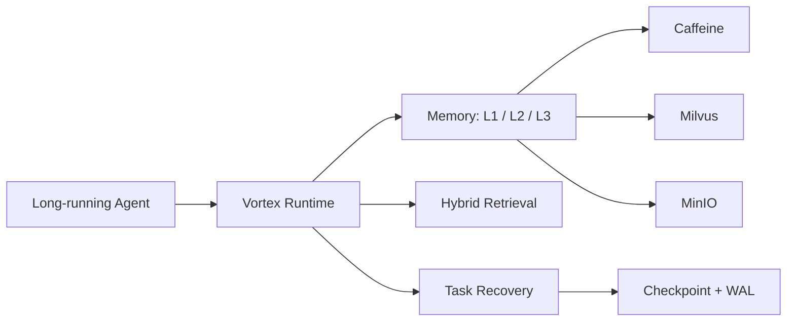
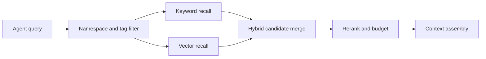
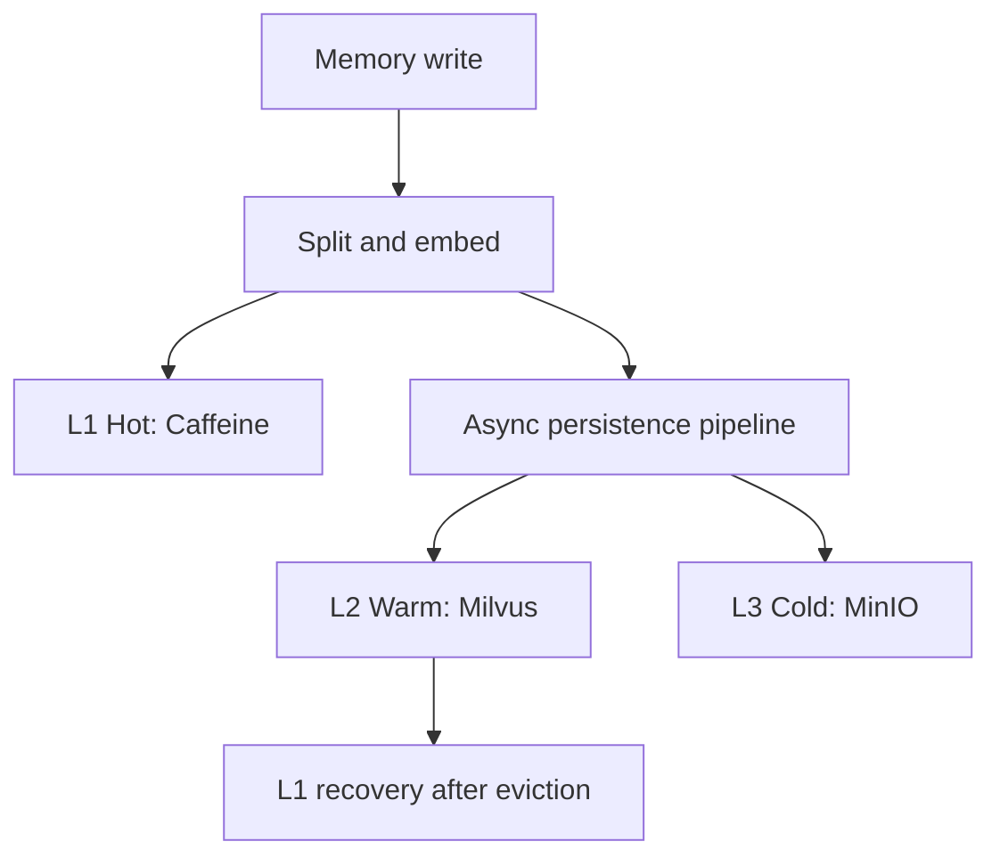
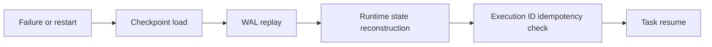

# Vortex

<p align="center">
  <a href="README.md">English</a> | 简体中文
</p>

[](https://github.com/HaibaraAi2517/Vortex/actions/workflows/ci.yml)
[](LICENSE)
[](pom.xml)
[](vortex-app/pom.xml)
[](docker-compose.yml)

**面向长时运行 AI Agent 的 Memory 与 RAG runtime：跨会话记住上下文，召回正确事实，并在崩溃后恢复任务。基于 Java 21、Spring Boot、Milvus、MinIO、Redis 和 Caffeine 构建。**

长时运行 Agent 的失败模式通常很稳定。Vortex 把这些失败模式变成后端 runtime 能力：

| Agent 痛点 | Vortex runtime 能力 |
| --- | --- |
| 跨会话和 token pressure 下上下文消失。 | L1 Caffeine、L2 Milvus、L3 MinIO 组成的分级长期记忆。 |
| 纯向量检索错过精确操作事实，召回质量退化。 | Hybrid recall：关键词 + 向量候选、rerank、namespace、tag 和 token budget。 |
| 多步骤任务在重启、工具失败或 LLM 异常后中断。 | Task DAG checkpoint、WAL replay、runtime snapshot 和 Execution ID 幂等。 |

<p align="center">
  <a href="#快速开始"><b>快速开始</b></a> ·
  <a href="examples/quickstart-agent"><b>Agent Demo</b></a> ·
  <a href="docs/architecture.md"><b>架构</b></a> ·
  <a href="docs/benchmark.md"><b>基准测试</b></a> ·
  <a href="docs/comparison.md"><b>定位对比</b></a>
</p>



Vortex 是有 benchmark 证据的基础设施内核，不是托管 SaaS。仓库同时维护可运行代码、deterministic eval harness、证据报告、runbook 和 CI governance check。

## 基准测试证据

下面的核心数据来自 deterministic benchmark，并链接了证据文件和复现命令。完整范围、边界和复现说明见 [docs/benchmark.md](docs/benchmark.md)。这些数据不是生产环境保证。

| 方向 | 结果 | 证据 |
| --- | --- | --- |
| Hybrid recall | `Hybrid+Rerank` 相比 `Vector+Rerank` 将 Recall@5 从 `0.7917` 提升到 `0.9500`，relative lift `+20.00%`；五种检索模式共 `100` 次运行，错误数 `0`。 | [Recall ablation evidence](ops/runbooks/vortex-recall-ablation-benchmark-evidence-20260630.md) |
| Main-path latency | 将 memory extraction、summary、embedding、L1 admission、L2 indexing 和 L3 archive 移出请求主路径后，P99 从 `1172.50 ms` 降至 `220.34 ms`，平均 latency 从 `829.40 ms` 降至 `186.64 ms`。 | [Main-path latency evidence](ops/runbooks/vortex-main-path-latency-benchmark-evidence-20260629.md) |
| Runtime recovery | deterministic fault-injection matrix 在 service restart、tool failure、LLM exception、state integrity 和 concurrency 五类场景中通过 `32/32` covered cases。 | [Runtime recovery evidence](ops/runbooks/vortex-runtime-recovery-benchmark-evidence-20260627.md) |

不要把这些结果表述为完整生产恢复覆盖、端到端 LLM 质量提升、线上 recall 提升或完整 Agent latency 降低。具体边界以链接的 evidence 文件为准。

## 架构

详细架构说明见 [docs/architecture.md](docs/architecture.md)。

Hybrid retrieval：



三级存储：



运行时恢复：



```text
vortex-app      REST API, Actuator, OpenAPI, eval CLI, benchmark runners
vortex-kernel   memory orchestration, recall, eviction, async pipeline, recovery
vortex-storage  L1 Caffeine, L2 Milvus, L3 MinIO
vortex-common   shared models, DTOs, serialization, exceptions, contracts
```

## 快速开始

容器优先的 quickstart 见 [docs/quickstart.md](docs/quickstart.md)。它会启动 Vortex、Milvus、MinIO、Redis 和 etcd，不需要任何外部 LLM API key。

本地开发可使用 Maven 路径：

前置条件：

- JDK 21
- Maven 3.9+
- Docker Desktop / Docker Compose

默认本地 BGE 模型文件已跟踪在 `models/bge-small-zh/`。

```powershell
docker compose up -d --wait
mvn -pl vortex-app -am -DskipTests package
java -jar .\vortex-app\target\vortex-app-0.1.0-SNAPSHOT-exec.jar
```

打开：

- Swagger UI：`http://localhost:8080/swagger-ui.html`
- Health：`http://localhost:8080/actuator/health`
- Prometheus：`http://localhost:8080/actuator/prometheus`
- MinIO console：`http://localhost:9001`，账号密码为 `minioadmin` / `minioadmin`

停止依赖：

```powershell
docker compose down
```

## 零 API Key Agent Demo

quickstart stack 运行后，可以试用 [examples/quickstart-agent](examples/quickstart-agent) 中的对比 demo：


本地录制输出 transcript：[docs/assets/quickstart-agent-demo.txt](docs/assets/quickstart-agent-demo.txt)。

```powershell
.\examples\quickstart-agent\run.ps1
```

它会展示 memory off/on 的差异，并强杀一个 worker 进程后从 Vortex checkpoint 恢复任务。不需要任何外部 LLM API key。

Java 用户也可以试用 [Spring AI ChatClient advisor example](examples/spring-ai-integration) 和 [LangChain4j AiServices transformer example](examples/langchain4j-integration)。两者都会把 Vortex recall 注入模型上下文，同样不需要外部 LLM key。

## 试用 Memory API

写入记忆：

```bash
curl -X POST http://localhost:8080/api/v1/memory/store \
  -H "Content-Type: application/json" \
  -d '{
    "content": "Java synchronized provides mutual exclusion and visibility guarantees.",
    "namespace": "session-1",
    "tags": ["java", "concurrency"],
    "reasoningChainId": "chain-1"
  }'
```

召回记忆：

```bash
curl -X POST http://localhost:8080/api/v1/memory/recall \
  -H "Content-Type: application/json" \
  -d '{
    "query": "Java concurrency lock visibility",
    "namespace": "session-1",
    "topK": 5,
    "tokenBudget": 2048,
    "tags": ["java"],
    "scenario": "coding"
  }'
```

异步 ingest 入口是 `POST /api/v1/memory/store/async`，pipeline 状态入口是 `GET /api/v1/memory/pipeline/{pipelineId}`。

## Task State 与恢复 API

Vortex 还提供面向长任务 Agent workflow 的 task-state kernel：

| 能力 | API |
| --- | --- |
| 创建、列表、查询、完成、失败、删除 task | `/api/v1/tasks` |
| 修改 task DAG node 和 edge | `/api/v1/tasks/{taskId}/nodes` |
| 更新 task context | `/api/v1/tasks/{taskId}/context` |
| 创建、列表、恢复 checkpoint | `/api/v1/tasks/{taskId}/checkpoint`, `/recover` |
| branch、switch、merge task state | `/branch`, `/branch/switch`, `/merge` |
| 导出 Graphviz DOT | `/api/v1/tasks/{taskId}/dag` |

会改变状态的 task API 支持可选 `X-Execution-Id` header，用于 replay 幂等保护。

## 构建与测试

CI 会运行单元测试、app integration verification、baseline governance 和 learning governance：

```powershell
mvn -B test -pl vortex-common,vortex-kernel,vortex-storage -am
mvn -B verify -pl vortex-app -am
./ops/run-baseline-governance-check.ps1 -SkipMavenTest -SkipPackage
./ops/run-learning-governance-check.ps1 -SkipMavenTest -SkipPackage -SkipLearningRun
```

`vortex-app` 的 integration verification 会在 `pre-integration-test` 启动 Docker Compose，并在 `post-integration-test` 停止服务。

## Eval CLI

打包 eval CLI：

```powershell
mvn -pl vortex-app -am -DskipTests package
```

可用 benchmark 命令：

```text
recall-benchmark
runtime-recovery-benchmark
async-pipeline-latency-benchmark
```

隔离 Milvus collection、MinIO prefix、WAL directory 和完整环境变量请看 evidence runbook：

- [Recall ablation](ops/runbooks/vortex-recall-ablation-benchmark-evidence-20260630.md)
- [Main-path latency](ops/runbooks/vortex-main-path-latency-benchmark-evidence-20260629.md)
- [Runtime recovery](ops/runbooks/vortex-runtime-recovery-benchmark-evidence-20260627.md)
- [Async pipeline latency](ops/runbooks/vortex-async-pipeline-latency-benchmark-evidence-20260628.md)

## 配置

默认配置位于 [`vortex-app/src/main/resources/application.yml`](vortex-app/src/main/resources/application.yml)。

常用环境变量：

| 变量 | 默认值 | 用途 |
| --- | --- | --- |
| `VORTEX_STORAGE_L1_MAX_TOKENS` | `8192` | L1 token 容量 |
| `MILVUS_HOST` / `MILVUS_PORT` | `localhost` / `19530` | Milvus 连接 |
| `VORTEX_STORAGE_L2_MILVUS_COLLECTION` | `vortex_memory` | Milvus collection |
| `VORTEX_L2_EMBEDDING_DIM` | `512` | L2 向量维度 |
| `MINIO_ENDPOINT` / `MINIO_BUCKET` | `http://localhost:9000` / `vortex` | L3 object storage |
| `MINIO_KEY_PREFIX` | 空 | 用于隔离的对象 key 前缀 |
| `VORTEX_EXECUTION_ID_BACKEND` | `MEMORY` | 幂等 backend，Redis 可选 |
| `BGE_MODEL_PATH` | `models/bge-small-zh` | 本地 BGE 模型目录 |
| `VORTEX_GENERATION_ENABLED` | `false` | 启用外部 LLM generation 集成 |
| `VORTEX_PAGING_ENABLED` | `true` | 启用 semantic paging |

Milvus 向量维度迁移是破坏性操作，必须显式确认：

```powershell
$env:MILVUS_DROP_COLLECTION = "true"
$env:MILVUS_DROP_CONFIRM_TOKEN = "I-KNOW-WHAT-I-AM-DOING"
```

一次性迁移完成后请重置这些值。

## 项目状态

Vortex 与纯向量 RAG、手写 memory layer 的定位差异见
[docs/comparison.md](docs/comparison.md)。首个 alpha release notes 草稿见
[docs/releases/v0.1.0-alpha.md](docs/releases/v0.1.0-alpha.md)。

已实现并有代码、测试或 runbook 覆盖：

- 分级 memory store、recall、feedback、pin/unpin 和 eviction。
- Vector、keyword、hybrid 和 rerank retrieval path。
- 带 persistence status tracking 的异步 memory ingest pipeline。
- Task DAG、checkpoint、WAL replay、branch/switch/merge 和 recovery。
- Health catalog、SLO snapshot、Prometheus metrics 和监控资产。
- Deterministic benchmark 与 governance harness。

暂不声称已经具备：

- 生产级 auth、RBAC、tenant isolation、rate limit 或 audit log。
- 长时间高并发生产容量结果。
- 分布式一致性、多节点调度或跨区域复制。
- 完整外部 process-manager crash-loop 编排。
- 在 latency benchmark 内集成真实 LLM generation 的完整 Agent runtime。

## 仓库结构

```text
.
|-- vortex-common/        shared contracts, DTOs, serialization, exceptions
|-- vortex-storage/       L1/L2/L3 storage APIs and implementations
|-- vortex-kernel/        memory, retrieval, recovery, snapshot, paging, learning
|-- vortex-app/           Spring Boot API, eval CLI, benchmark runners, tests
|-- ops/                  runbooks, evidence reports, CI/governance scripts
|-- docs/                 architecture and benchmark summaries
|-- demo/                 demo scripts
|-- examples/             focused runnable examples
|-- models/bge-small-zh/  default local BGE-Small model files
|-- docker-compose.yml    etcd, Milvus, MinIO, Redis
`-- pom.xml               Maven multi-module parent
```

## 技术栈

- Java 21 with preview enabled
- Spring Boot 3.3.4
- Maven multi-module build
- Caffeine 3.1.8
- Milvus SDK 2.4.4
- MinIO 8.5.11
- Redis 7.2 optional Execution ID backend
- Kryo 5.6.0
- DJL 0.28.0 and ONNX Runtime 1.18.0 for local BGE embeddings
- Testcontainers 2.0.2

## 社区协作

- 贡献指南：[CONTRIBUTING.md](CONTRIBUTING.md)
- Roadmap：[ROADMAP.md](ROADMAP.md)
- Code of conduct：[CODE_OF_CONDUCT.md](CODE_OF_CONDUCT.md)
- GitHub description/topics 建议：[docs/repo-settings.md](docs/repo-settings.md)

## 许可证

Vortex 代码与文档使用 [Apache License 2.0](LICENSE)。

第三方模型文件、数据集和外部服务名称仍受各自上游许可与服务条款约束。
