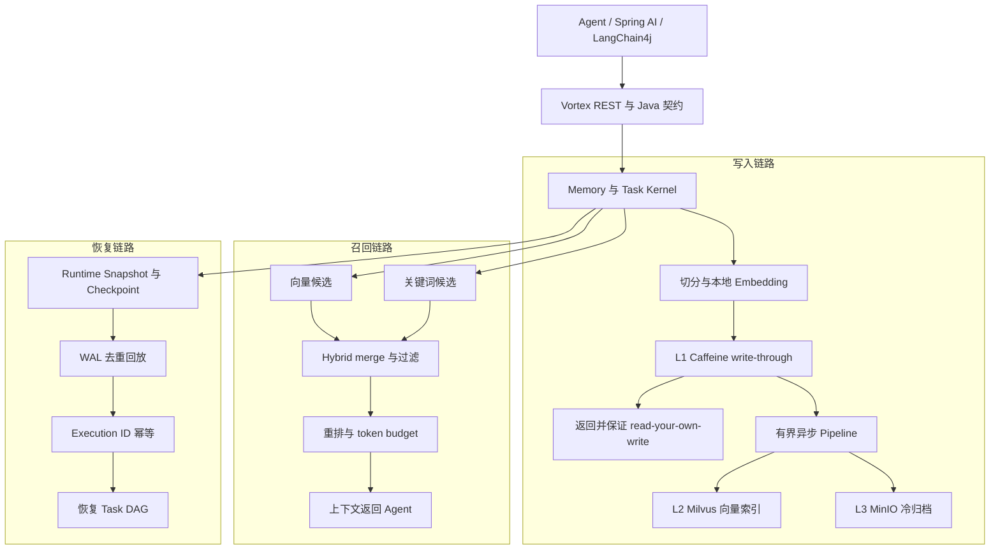

# Vortex

<p align="center">
  <a href="README.md">English</a> | 简体中文
</p>

[](https://github.com/HaibaraAi2517/Vortex/actions/workflows/ci.yml)
[](docs/releases/v0.1.0.md)
[](LICENSE)
[](pom.xml)
[](vortex-app/pom.xml)
[](docker-compose.yml)

**面向长时运行 AI Agent 的 Memory 与 RAG runtime：跨会话记住上下文，召回正确事实，并在崩溃后恢复任务。基于 Java 21、Spring Boot、Milvus、MinIO、Redis 和 Caffeine 构建。**

`v0.1.0` 是面向项目审阅的稳定证据版本。Vortex 不是托管 SaaS，而是一个
Agent Memory 与任务恢复内核；仓库把实现代码、确定性基准、故障注入证据和
复现路径放在一起，便于直接核验。

<p align="center">
  <a href="#快速开始"><b>快速开始</b></a> ·
  <a href="#三个核心技术决策及取舍"><b>技术决策</b></a> ·
  <a href="docs/benchmark.md"><b>基准证据</b></a> ·
  <a href="docs/architecture.md"><b>详细架构</b></a>
</p>

## 系统架构



同步边界止于 L1 可见；最终索引和归档进入有界后台 Pipeline，召回与恢复保持为
独立内核路径。这个边界是项目在延迟、一致性和故障恢复之间最核心的设计选择。

## 快速开始

前置条件只有 Docker Desktop，或支持 Compose 的 Docker Engine，并预留至少
6 GB 内存。下面一条命令会构建并启动完整环境，等待健康检查，完成记忆写入与
召回，然后在 Checkpoint 后强杀 Worker 并恢复任务：

```powershell
powershell -NoProfile -ExecutionPolicy Bypass -File .\examples\quickstart-agent\run.ps1 -StartQuickstart
```

Linux/macOS：

```bash
START_QUICKSTART=true bash examples/quickstart-agent/run.sh
```

成功输出会先出现 `WITH VORTEX: recalled durable memory`，再出现
`WITH VORTEX: recovered task ...`，最后打印
`No external LLM API key was used.`。停止环境：

```powershell
docker compose -f docker-compose.quickstart.yml down
```

录制输出和完整 HTTP 操作见
[examples/quickstart-agent](examples/quickstart-agent) 与
[docs/quickstart.md](docs/quickstart.md)。

## 基准测试证据

下面的核心数据来自 deterministic benchmark，并链接了证据文件和复现命令。完整范围、边界和复现说明见 [docs/benchmark.md](docs/benchmark.md)。这些数据不是生产环境保证。

| 方向 | 结果 | 证据 |
| --- | --- | --- |
| LongMemEval recall | 官方 LongMemEval oracle 的 120-case case-isolated 评测完成五种模式 `600` 次配对运行，错误数 `0`。`VectorOnly` fragment Recall@5 为 `0.8094`，相对 `KeywordOnly` 提升 `+0.1856`，paired 95% CI `[+0.1086, +0.2632]`。 | [LongMemEval 评测报告](ops/runbooks/vortex-recall-longmemeval-evaluation-report-20260729.md) |
| Cross-Encoder 门禁 | 锁定的 ONNX Cross-Encoder DEV 候选在 `120/120` case 改变排序，但未通过五项冻结的质量与延迟规则。`VectorOnly` 保持默认，validation 和 reserve 均未运行。 | [Cross-Encoder DEV 决策](ops/runbooks/vortex-cross-encoder-dev-decision-20260729.md) |
| Main-path latency | 返回前同步完成 raw-memory L1 write-through，最终处理进入有界后台 Pipeline；100 case/mode 下 P99 从 `818.82 ms` 降至 `268.65 ms`（`-67.19%`），返回时 L1 可见率和最终 L2/L3 readiness 均为 `100%`。 | [Write-through 延迟证据](ops/runbooks/vortex-main-path-latency-write-through-evidence-20260728.md) |
| Runtime recovery | deterministic fault-injection matrix 在 service restart、tool failure、LLM exception、state integrity 和 concurrency 五类场景中通过 `32/32` covered cases。 | [Runtime recovery evidence](ops/runbooks/vortex-runtime-recovery-benchmark-evidence-20260627.md) |

Recall 是 oracle fragment 检索指标，不是答案准确率。延迟来自排除外部 LLM generation
的本地确定性 benchmark，不是 production P99 或完整 Agent latency。Cross-Encoder
被拒绝的结果也不能表述为模型收益；具体边界以链接的 evidence 文件为准。

## 三个核心技术决策及取舍

### 1. L1 write-through 后返回，最终持久化异步化

**问题。** 如果每次写入都同步完成记忆抽取、摘要、向量索引和冷归档，请求主链路
会为调用方返回前并不需要的工作付出延迟。

**决策。** Vortex 只把 raw-memory L1 write-through 放在同步边界内，最终抽取、
L2 索引和 L3 归档进入带重试与 backpressure 的有界 Pipeline。调用方获得
read-your-own-write，同时不等待所有持久层完成。

**取舍。** 系统接受 L2/L3 最终一致，并必须暴露 Pipeline 状态与失败处理。换来的
结果是：100 case/mode 的确定性基准中，主链路 P99 从 `818.82 ms` 降至
`268.65 ms`，返回时 L1 可见率和最终 L2/L3 readiness 均为 `100%`。证据见
[write-through 延迟报告](ops/runbooks/vortex-main-path-latency-write-through-evidence-20260728.md)。

### 2. 选择可审计的召回基线，不上线未被证据支持的重排模型

**问题。** 共享评测命名空间会造成跨用例数据泄漏，而重排模型仅仅“改变排序”并不
等于提升召回质量。

**决策。** 废弃污染结果，按 case 隔离重跑 LongMemEval，并用五项冻结的质量与
延迟规则控制模型晋级。锁定的 ONNX Cross-Encoder 虽改变 `120/120` 个排序，
但未通过门禁，因此默认路径保持 `VectorOnly`。

**取舍。** 项目暂时放弃推测性的重排收益，保留更简单、延迟更低且可解释的服务路径。
隔离后的 120-case 评测中 fragment Recall@5 为 `0.8094`，相对
`KeywordOnly` 提升 `+0.1856`，paired 95% CI 为
`[+0.1086, +0.2632]`。证据见
[LongMemEval 报告](ops/runbooks/vortex-recall-longmemeval-evaluation-report-20260729.md)
和 [Cross-Encoder 决策](ops/runbooks/vortex-cross-encoder-dev-decision-20260729.md)。

### 3. Snapshot + WAL + Execution ID，不声称分布式 exactly-once

**问题。** 仅有 Checkpoint 无法区分重启前已经完成和仍在执行的 Tool/LLM 调用，
直接 replay 可能重复产生副作用。

**决策。** Runtime Snapshot 持久化 Task DAG、Conversation、Memory 引用和
Tool/LLM 状态；恢复时加载 Checkpoint、去重回放 WAL、重建状态，再以
Execution ID 请求哈希、原子占位与响应重放保证幂等。

**取舍。** 方案增加序列化成本、WAL 写放大和状态迁移约束，提供的是确定性的单运行时
恢复，而不是分布式一致性或跨区域 exactly-once。故障注入矩阵在五类场景中通过
`32/32` covered cases。证据见
[runtime recovery 报告](ops/runbooks/vortex-runtime-recovery-benchmark-evidence-20260627.md)。

## 已实现范围

| 方向 | 已实现能力 |
| --- | --- |
| Memory | store、recall、feedback、pin/unpin、eviction、异步 ingest 状态、namespace/tag 过滤与 token budget |
| Retrieval | keyword、vector、hybrid candidate merge、可选重排门禁与 context assembly |
| Runtime state | Task DAG 修改、Checkpoint、WAL replay、branch/switch/merge 与 Execution ID 幂等 |
| Storage | L1 Caffeine、L2 Milvus、L3 MinIO，以及可选 Redis Execution ID backend |
| Model integration | Vortex generation/embedding 契约、Spring AI 示例和 LangChain4j adapter |

Quickstart 后可通过 `http://localhost:8080/swagger-ui.html` 查看完整 REST
接口。详细 endpoint 和配置继续由 [docs/quickstart.md](docs/quickstart.md) 与
[docs/architecture.md](docs/architecture.md) 承接。

## 构建与测试

CI 会运行单元测试、app integration verification、baseline governance 和 learning governance：

```powershell
mvn -B test -pl vortex-common,vortex-kernel,vortex-storage,vortex-langchain4j -am
mvn -B verify -pl vortex-app -am
./ops/run-baseline-governance-check.ps1 -SkipMavenTest -SkipPackage
./ops/run-learning-governance-check.ps1 -SkipMavenTest -SkipPackage -SkipLearningRun
```

`vortex-app` 的 integration verification 会在 `pre-integration-test` 启动 Docker Compose，并在 `post-integration-test` 停止服务。

## 证据与复现

- [Benchmark 范围与核心结果](docs/benchmark.md)
- [架构与组件边界](docs/architecture.md)
- [LongMemEval case-isolated 评测](ops/runbooks/vortex-recall-longmemeval-evaluation-report-20260729.md)
- [主链路 write-through 延迟证据](ops/runbooks/vortex-main-path-latency-write-through-evidence-20260728.md)
- [Runtime recovery 故障注入证据](ops/runbooks/vortex-runtime-recovery-benchmark-evidence-20260627.md)
- [稳定版 v0.1.0 发布说明](docs/releases/v0.1.0.md)

## 项目状态

Vortex 与纯向量 RAG、手写 memory layer 的定位差异见
[docs/comparison.md](docs/comparison.md)。面向项目审阅的稳定版本为
[`v0.1.0`](docs/releases/v0.1.0.md)，原 alpha 说明保留归档。

已实现并有代码、测试或 runbook 覆盖：

- 分级 memory store、recall、feedback、pin/unpin 和 eviction。
- Vector、keyword、hybrid 和 rerank retrieval path。
- 带 persistence status tracking 的异步 memory ingest pipeline。
- Task DAG、checkpoint、WAL replay、branch/switch/merge 和 recovery。
- Health catalog、SLO snapshot、Prometheus metrics 和监控资产。
- Deterministic benchmark 与 governance harness。
- 面向 LLM generation 与 embedding provider 的可选 LangChain4j 适配层。

暂不声称已经具备：

- 生产级 auth、RBAC、tenant isolation、rate limit 或 audit log。
- 长时间高并发生产容量结果。
- 分布式一致性、多节点调度或跨区域复制。
- 完整外部 process-manager crash-loop 编排。
- 在 latency benchmark 内集成真实 LLM generation 的完整 Agent runtime。

## 仓库结构

```text
.
|-- vortex-common/        shared contracts, DTOs, serialization, exceptions
|-- vortex-storage/       L1/L2/L3 storage APIs and implementations
|-- vortex-kernel/        memory, retrieval, recovery, snapshot, paging, learning
|-- vortex-langchain4j/   optional ChatModel and EmbeddingModel adapters
|-- vortex-app/           Spring Boot API, eval CLI, benchmark runners, tests
|-- ops/                  runbooks, evidence reports, CI/governance scripts
|-- docs/                 architecture and benchmark summaries
|-- demo/                 demo scripts
|-- examples/             focused runnable examples
|-- models/bge-small-zh/  default local BGE-Small model files
|-- docker-compose.yml    etcd, Milvus, MinIO, Redis
`-- pom.xml               Maven multi-module parent
```

## 技术栈

- Java 21 with preview enabled
- Spring Boot 3.3.4
- Maven multi-module build
- Caffeine 3.1.8
- Milvus SDK 2.4.4
- MinIO 8.5.11
- Redis 7.2 optional Execution ID backend
- Kryo 5.6.0
- DJL 0.28.0 and ONNX Runtime 1.18.0 for local BGE embeddings
- LangChain4j 1.18.0 optional LLM and embedding adapters
- Testcontainers 2.0.2

## 审阅路径

建议先阅读顶部系统图和三个技术决策，再通过链接的 evidence 报告核对评测边界。
上面的模块结构可直接定位到对应实现。

## 许可证

Vortex 代码与文档使用 [Apache License 2.0](LICENSE)。

第三方模型文件、数据集和外部服务名称仍受各自上游许可与服务条款约束。
