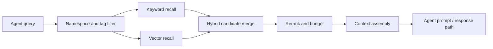
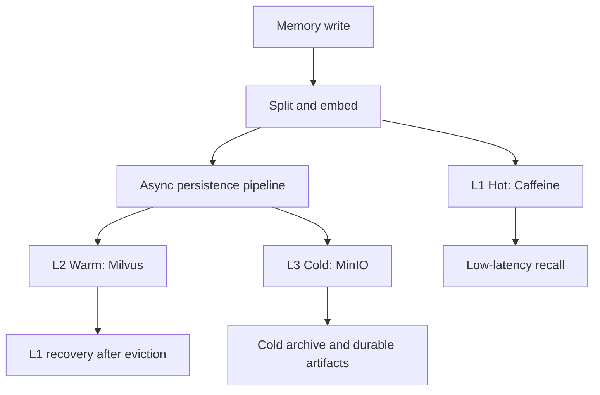
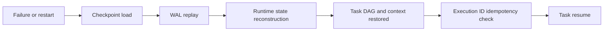

# Vortex Architecture

Vortex is organized around three runtime concerns for long-running agents:
memory recall, memory durability, and task recovery. The diagrams below are
GitHub-native Mermaid diagrams and do not depend on external image hosting.

## Hybrid Retrieval Pipeline

The retrieval path combines lexical and vector candidates, then applies
reranking, namespace isolation, tag filtering, and token-budget-aware context
assembly before handing memory back to the agent runtime.

## Three-Tier Memory Storage

L1 is optimized for hot low-latency access, L2 for vector retrieval and
recovery after eviction, and L3 for cold fragments and checkpoint/WAL-related
artifacts.

## Runtime Recovery Flow

Recovery reconstructs covered task/runtime state from checkpoint + WAL,
including DAG state, context, conversation/tool/LLM runtime snapshots, and
Execution ID replay protection in the deterministic benchmark scope.
